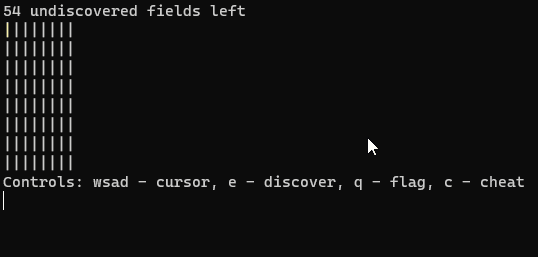

# Console Minesweeper
Minesweeper game created with C for console.
## Features
- Fully playable minesweeper game
- Hardcoded board 8x8 with 10 mines
- Colored fields
- Controls explained inside game
## Showcase

## Development
### MVP
- Generating mines at random positions ✔️
- Generating numbers for fields ✔️
- Moving cursor ✔️
- Discovering field ✔️
- Win and Lose detection ✔️
### Extra
- Mass discovering on empty field ✔️
- Flagging field ✔️
- Coloring fields ✔️
- Cheating (revealing discovered board) ❌
- User inputing board parameters ❌
---
### Used technologies
[][c]

[c]: https://en.wikipedia.org/wiki/C_(programming_language)